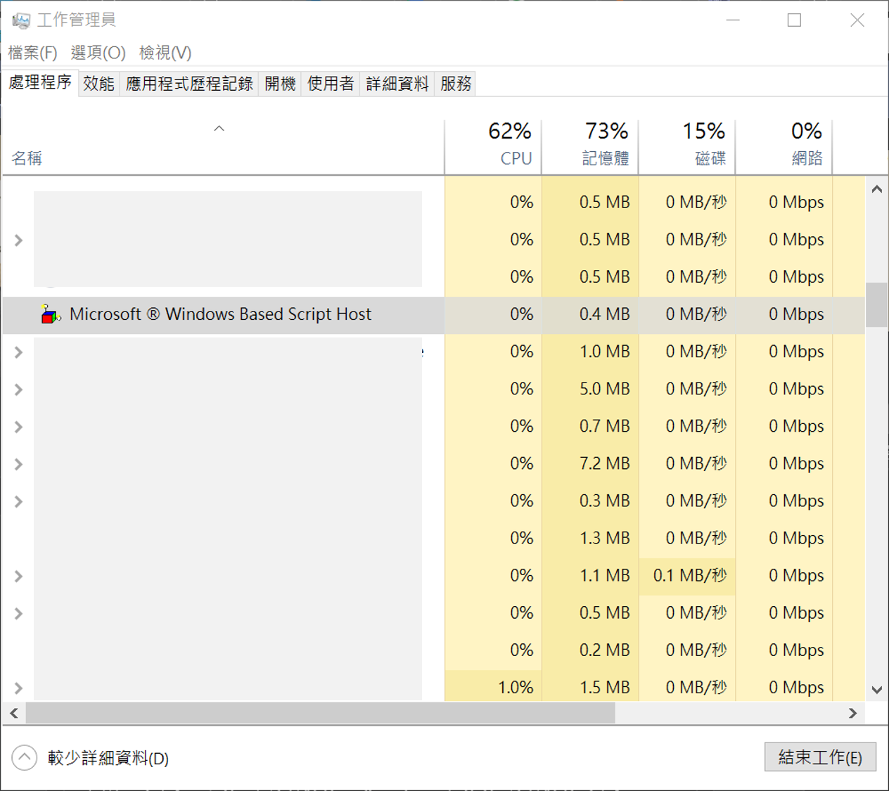
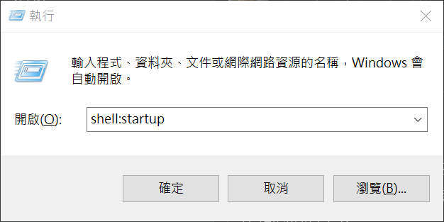

Project Name: 防止勒索病毒的侵害
==============

Installation and Usage
=============

### 1. 本程式會在 !DoNotDelete.png 被加密時強制關機，以防止其他檔案被加密。

### Tutorial:

1. 請把 !DoNotDelete.png 及 !DoNotDelete.vbs 兩個檔案放在 C:\ 內。

2. 請注意此二檔案不能更改檔名，並且不能放在其他目錄或子目錄。

3. 在執行 !DoNotDelete.vbs 檔案前，請先將其他程式存檔，以避免萬一強制關機時未儲存的資料遺失。

4. 確定可正確執行（工作管理員可看到 Microsoft R Windows Based Script Host）後，可將 !DoNotDelete.vbs 建立捷徑，並放到開機時啟動資料夾內。

5. 開機時啟動資料夾，可執行「shell:startup」來開啟。

### Chinese Tutorial:

Inspired By
=============

License
=============

opyright {yyyy} Sean Chen

Licensed under the Apache License, Version 2.0 (the "License");
you may not use this file except in compliance with the License.
You may obtain a copy of the License at

http://www.apache.org/licenses/LICENSE-2.0

Unless required by applicable law or agreed to in writing, software
distributed under the License is distributed on an "AS IS" BASIS,
WITHOUT WARRANTIES OR CONDITIONS OF ANY KIND, either express or implied.
See the License for the specific language governing permissions and
limitations under the License.